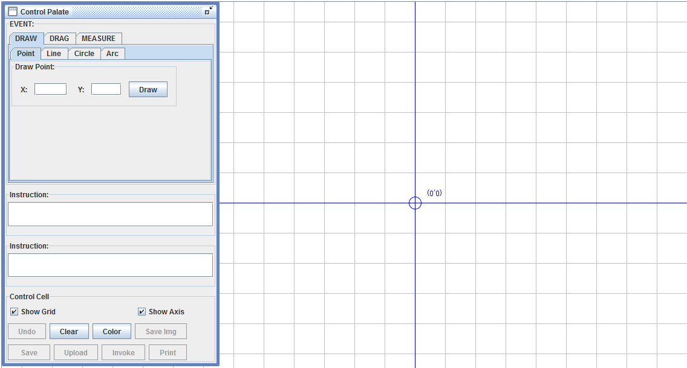

## Procedure

In this experiment you will guided through the position analysis of a 4 bar RRRR Grashofian double Crank. Position analysis can be approached analytically. Using complex numbers is a popular analytical approach. The animated guide that follows right next shows the analytical method of determining the position of a point on the coupler of a RRRR linkage as the linkage moves. The next animation shows the graphical constructions needed for the position analysis of a double crank linkage. A summary of what you are expected to do follows. This is followed by stwo animated guides for finding out the two extreme configurations for the slider, because in a slider crank, while the input link (link 2 - crank) does rotate through a full circle, the slider has limits on its displacement. There are thus two extreme positions of the slider and the corresponding crank angles that you are expected to find out using these guides.

- In the **Instruments** tab use the first applet to choose a set of 4 link lengths. Enter your choices for link lengths. The apllet will let you know if the lengths conform to a Grashofian Double Crank. If your link lengths are improper go back to the Introduction tab and check the Crashofs criteria Grashofian Double Crank and modify link lengths accordingly.
- Use the **Drawing Board** applet in the **Instruments** tab to find the linkage configuration for a given input link orientation (theta 2).
- Finally there is a third applet in the Instruments tab which lets you verify your results. Enter your answers to see the correct values for coupler position and the accuracy of your answers obtained graphically.
The following are animated guides for analytical and graphical methods of position analysis for a 4 bar RRRR Grashofian Double Crank.

  
    <object width="900" height="700" data="./content/Cmplx_pos_ana_RRRP/index.html"></object>
                            

 
   <object width="900" height="700" data="./content/Gra_pos_ana_RRRP/index.html"></object>
                            
                           

## Instrument

Choose link lengths, preferably keeping them within 10 units length for easy viewing of animations. Enter them and a coupler arm length and orientation of your choice in the following applet in the designated text boxes. Link 1 represents the ground link. Press the **Enter** button to verify if your data conforms to a Grashofian Crank Rocker. Note that coupler arm length and orientation play no role in Grashof's criteria, but you are merely asked to enter them for use in later stages. In case you get a message stating that your data does not conform to a Grashofian Crank Rocker.

    <object width="700" height="250" data="./content/GrashofRRRPSliderCrankChecker/index.html"></object>
                            

Once your link lengths are validated, you are expected to find out graphically the limiting positions of the crank rocker using the Drawing Board Applet which will open when you click the link below. A new browser window will open along with the applet. Since the linkage is a crank rocker, therefore the follower link will rotate between two limits of theta 4. You are required to find those limits using this applet. The applet uses screen coordinates for drawing. Hence if you are using link lengths between 1 to 10 units it is advisable (although zoom is available for the applet) to choose a scale between 100:1 to 10:1 for easy on screen use.

[Java Script Simulator](drawing-board-js/drawing-board.html)

To get an animated guidance of the graphical analysis using the applet click below:

[How to use the Drawing Board to find coupler position](drawing-board-demo.html)

Validate your answer using the applet below

 <object width="700" height="400" data="./content/GrashofRRRPSliderCrankCouplerPositionChecker/index.html"></object>
                            

 <object width="700" height="400" data="./content/GrashofRRRPSliderCrankLimitPositionChecker/index.html"></object>
                            

