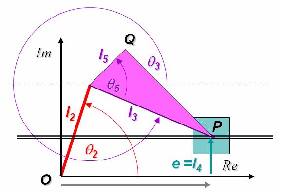

### Introduction

**Position Analysis of a 4 Bar RRRP Grashofian Slider Crank Mechanism**

The 4 bar RRRP mechanism is another basic mechanism in studies on kinematics. It is also widely used in various forms because of the relative simplicity of design and manufacture. Like RRRR linkages, Grashof's criteria is used to distinguish between 4 bar linkages with one prismatic joint, depending on the rotatability of the links In brief, if l is the shorter of the crank and the coupler and L the longer of the two, and e is the offset, then the following cases arise

- l + e < L : Grashofian linkage
  - l + e < L, shortest link s is the ground link. : Inverted Slider Crank (RRPR)
  - l + e < L , shortest link is the coupler : Inverted Slider Rocker (RRPR)
  - l + e < L , shortest link is crank : Slider Crank (RRRP)
  - l + e < L , shortest link is coupler : Slider Rocker (RRRP)
- l + e > L : Non Grashofian linkage
For a more detailed introduction to Grashof criteria see the animated guide that follows. If undisturbed , the animation will proceed at a predetermined pace. You can either click on the animation itself to move from step to step as per your convenience. Alternatively you can use the controls at the bottom of the animation to see it at your own pace.

In a Grashofian Slider Crank the input link (link 2) can rotate through a full circle. Since the input link rotates through a full circle it is possible to drive this mechanism using a simple continuous rotary drive, that is we may connect it directly to a simple motor.